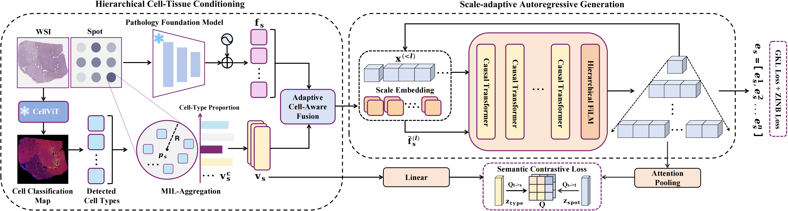

# Path2ST
## Hierarchical Cell-Tissue Grounded Cross-Modal Translation for Spatial Transcriptomics.

Analogous to natural language, pathology images exhibit an intrinsic hierarchical and compositional structure. Individual cells function as words, whose semantics are determined by both their morphology and the surrounding context. Spatial spots function as sentences, whose gene expression profiles represent emergent semantics arising from the interplay between cellular composition and the tissue microenvironment. Moreover, gene expression is not a flat vector but a structured system organized by co-expression modules. Inferring spatial transcriptomics from H&E images is therefore fundamentally a hierarchical cross-modal semantic translation problem. From this perspective, we propose Path2ST, which jointly incorporates cell types and the tissue microenvironment as the generative condition and further introduces more comprehensive supervision.

The paper is currently under review. We provide the implementation code for the core methodology at this stage. The complete code, including training code, will be made publicly available upon acceptance.
